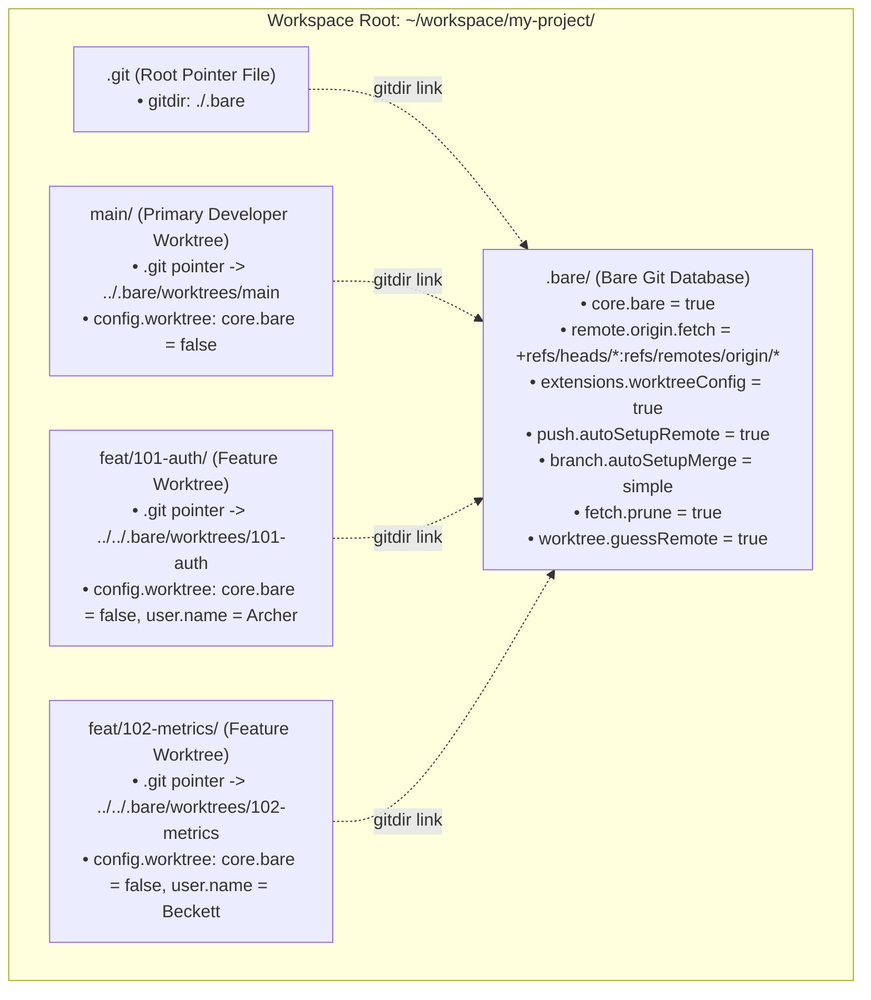

# Reference: Pure Bare Repository Root Topology & Worktree Internals

This reference documents the architectural invariants, plumbing configuration,
and recovery procedures for the **Pure Bare Repository Root Topology**
(originating from `ADR-0003` in `agent-teams`).

______________________________________________________________________

## 1. Why Pure Bare Topology (`.bare/` + `.git` + `main/` + `<branch-name>/`)?

Standard Git clones place `.git/` inside the primary working tree, making the
default branch (`main`) structurally privileged and prone to root directory
contamination from untracked build artifacts, caches, or accidental agent edits.

The **Pure Bare Repository Root** treats all working copies—including `main` and
ephemeral feature branches—as symmetric linked worktrees placed directly inside
the workspace root matching their branch names:



### Key Benefits

1. **Zero Root Contamination**: `<root>/.bare/` contains exclusively Git objects
   and administrative metadata. Running `git clean -fdx` inside any worktree
   cannot affect `.bare/` or sibling worktrees.
1. **Root VCS Recognition (`<root>/.git`)**: Writing `gitdir: ./.bare` into
   `<root>/.git` lets Antigravity, IDEs, shell prompts, and Git metadata
   commands (`git worktree list`, `git fetch`, `git branch`) work directly from
   `<root>/` while `core.bare = true` in `.bare` still prevents accidental
   checkouts at the workspace root.
1. **Symmetric Branch Folder Layout**: Every branch—whether `main`,
   `feat/101-auth`, or `fix/sigterm`—lives directly at `<root>/<branch-name>/`.
1. **IDE & Language Server Isolation**: Opening `<root>/main` or
   `<root>/feat/101-auth` scopes `gopls`, `tsserver`, and linters strictly to
   that single worktree without recursive parent/child overlap.
1. **Concurrent Multi-Agent Safety**: Multiple agents can compile, test, and
   commit in parallel worktrees with distinct Git author identities.
1. **Instant `main/` Recovery**: If `<root>/main/` ever becomes corrupted, it
   can be removed and recreated via
   `git --git-dir=.bare worktree add main origin/main` in under 50ms without
   re-cloning history.

______________________________________________________________________

## 2. Critical Plumbing Settings Explained

### A. Root `.git` Pointer File (`gitdir: ./.bare`)

By placing a one-line `.git` file at the workspace root:

```bash
echo "gitdir: ./.bare" > <root>/.git
```

Git and developer tools (including Antigravity's workspace VCS detector)
immediately recognize `<root>/` as a Git workspace without requiring
`--git-dir=.bare` on every root command, while child worktrees (`main/.git`,
`<branch-name>/.git`) override it with their own worktree-specific `gitdir`
pointers.

### B. Wildcard Fetch Refspec (`remote.origin.fetch`)

By default, `git clone --bare` does **not** set a `remote.origin.fetch` refspec,
causing subsequent `git fetch origin` runs to silently skip updating
`refs/remotes/origin/*`. Every `.bare` repository MUST configure:

```bash
git --git-dir=<root>/.bare config remote.origin.fetch "+refs/heads/*:refs/remotes/origin/*"
```

### C. Per-Worktree Configuration (`extensions.worktreeConfig`)

Because `<root>/.bare/config` has `core.bare = true`, linked worktrees inherit
`core.bare = true` unless per-worktree config is enabled and overridden. Enable
the extension once on `.bare`:

```bash
git --git-dir=<root>/.bare config extensions.worktreeConfig true
```

Then, in every linked worktree (`main/` and `<branch-name>/`), set:

```bash
git -C <worktree-path> config --worktree core.bare false
```

This writes to `<root>/.bare/worktrees/<worktree-name>/config.worktree`, keeping
`.bare` bare while allowing full working tree operations in the linked worktree.

### D. Ergonomic Bare Worktree Defaults

To avoid upstream tracking mismatches when branching from `origin/main` and to
keep remote tracking refs clean after PR merges, every `.bare` repository
configures:

```bash
git --git-dir=<root>/.bare config push.autoSetupRemote true
git --git-dir=<root>/.bare config branch.autoSetupMerge simple
git --git-dir=<root>/.bare config fetch.prune true
git --git-dir=<root>/.bare config worktree.guessRemote true
```

### E. Per-Worktree Author Identity Isolation

With `extensions.worktreeConfig = true`, each agent worktree can set its own
author identity without affecting global `~/.gitconfig` or `.bare/config`:

```bash
git -C <worktree-path> config --worktree user.name "Archer"
git -C <worktree-path> config --worktree user.email "user+agent-archer@example.com"
```

______________________________________________________________________

## 3. Troubleshooting & Recovery Runbook

### Problem: `fatal: not a git repository` or `fatal: this operation must be run in a work tree`

- **Cause**: A Git command requiring a working tree (`git status`, `git diff`,
  `git add`, `git commit`) was invoked at `<root>/` or against `.bare/` without
  specifying a worktree.
- **Fix**: Pass `-C <root>/main` or `-C <root>/<branch-name>`.

### Problem: `fatal: reftable: transaction prepare: I/O error` or `Read-only file system` on `config.worktree`

- **Cause**: The Antigravity terminal sandbox mounts `.git` / `.bare`
  directories read-only and blocks `reftable` lock transactions.
- **Fix**: Re-run the state-changing `git` command with `BypassSandbox: true`.

### Problem: `gh pr merge --delete-branch` fails with `fatal: 'main' is already used by worktree`

- **Cause**: `gh pr merge --delete-branch` attempts to run `git checkout main`
  locally inside the feature worktree before deleting the feature branch, which
  collides with `<root>/main/`.
- **Fix**:
  1. Enable server-side branch deletion:
     `gh repo edit --delete-branch-on-merge`.
  1. Run `gh pr merge <pr-number> --squash` **without** `--delete-branch`.
  1. Remove the worktree and local branch from `.bare`:
     ```bash
     glen remove <branch-name> -C <root>
     ```

### Problem: Workspace Directory Was Moved or Renamed

- **Cause**: Linked worktrees use relative or absolute `.git` pointer files that
  break if the parent directory is relocated.
- **Fix**: Run worktree repair (`BypassSandbox: true`):
  ```bash
  glen repair <root>
  ```

### Problem: Stale Worktree Lock or Deleted Directory

- **Cause**: A worktree directory was deleted via `rm -rf` or an agent process
  crashed mid-operation, leaving stale administrative entries under
  `.bare/worktrees/<slug>`.
- **Fix**: Prune expired worktree metadata immediately (`BypassSandbox: true`):
  ```bash
  git --git-dir=<root>/.bare worktree prune --expire now
  ```
